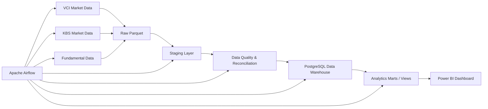

# Stock Data Platform

An end-to-end **Data Engineering platform for Vietnamese stock market analytics**, covering multi-source ingestion, incremental processing, data quality validation, reconciliation, dimensional modeling, orchestration, analytics marts, and Power BI reporting.

The project currently tracks six Vietnamese stocks:

**FPT · HPG · MWG · SSI · VCB · VNM**

---

## Project Objectives

This project is designed to demonstrate a complete data engineering workflow:

- Ingest historical and incremental stock market data from multiple sources.
- Store raw data in Parquet for reproducibility and traceability.
- Standardize and transform data through staging layers.
- Load curated data into a PostgreSQL data warehouse.
- Reconcile VCI and KBS market data and measure source discrepancies.
- Validate warehouse quality and source freshness.
- Build analytics-ready materialized views and signals.
- Orchestrate recurring pipelines with Apache Airflow.
- Visualize market, data-quality, and fundamental insights in Power BI.

---

## Architecture



---

## Tech Stack

| Layer | Technology |
|---|---|
| Programming | Python |
| Data ingestion | vnstock, VCI, KBS |
| Storage | Parquet |
| Data processing | Pandas, PyArrow |
| Data warehouse | PostgreSQL |
| Orchestration | Apache Airflow 3 |
| Containerization | Docker / Docker Compose |
| Data quality | Python validation + source reconciliation |
| Analytics | SQL materialized views |
| Visualization | Microsoft Power BI |
| Version control | Git / GitHub |

---

## Data Pipeline

### 1. Market Data

The daily market pipeline processes OHLCV data from **VCI** and **KBS**.

Main flow:

```text
VCI + KBS
   ↓
Incremental ingestion
   ↓
Raw Parquet
   ↓
Multi-source staging
   ↓
PostgreSQL warehouse
   ↓
VCI vs KBS reconciliation
   ↓
Data-quality checks
   ↓
Analytics marts
```

The warehouse stores both sources instead of immediately discarding one source, allowing cross-source validation before producing a canonical analytics layer.

### 2. Fundamental Data

Fundamental financial statements are processed separately:

```text
Financial statements
   ↓
Raw fundamental Parquet
   ↓
Fundamental staging
   ↓
fact_financial_metric
   ↓
Financial data-quality checks
   ↓
Financial analytics mart
```

### 3. Incremental Processing

The project supports incremental ingestion so that recurring runs only request and process newly available market data instead of rebuilding the entire historical dataset.

---

## Airflow Orchestration

Two main DAGs are included.

### `stock_market_daily`

Runs the recurring market-data workflow:

- Audit pipeline start
- Ingest VCI incremental data
- Ingest KBS incremental data
- Build multi-source incremental staging
- Load warehouse
- Rebuild consolidated staging when required
- Reconcile VCI vs KBS
- Run warehouse data-quality checks
- Check source freshness
- Refresh analytics marts
- Audit successful completion

### `fundamental_weekly`

Processes financial-statement data:

- Ingest fundamental data
- Build fundamental staging
- Load the financial warehouse
- Run financial data-quality checks
- Refresh the financial mart
- Record pipeline audit status

Airflow runs through Docker Compose and is available locally at:

```text
http://localhost:8081
```

---

## Data Warehouse

Core warehouse objects include:

### Dimensions

- `dim_date`
- `dim_stock`
- `dim_period`

### Fact Tables

- `fact_stock_price`
- `fact_financial_metric`

### Monitoring

- `pipeline_run_audit`

### Analytics Marts

- `mart_stock_price_canonical`
- `mart_stock_quality_summary`
- `mart_stock_overview`
- `mart_stock_signals`
- `mart_financial_latest`

Power BI consumes reporting views built on top of these marts.

---

## Data Quality & Reconciliation

The platform does not assume that two market-data providers always return identical values.

Validation includes:

- NULL price checks
- Negative-price checks
- Negative-volume checks
- `High < Low` validation
- Open/Close outside High-Low range
- Duplicate fact detection
- Source freshness checks
- VCI vs KBS close-price comparison
- VCI vs KBS volume comparison
- Discrepancy-rate calculation

A validation snapshot of the historical dataset produced:

- **4,044** matched VCI/KBS observations
- Mean close-price difference: **~0.081%**
- Median close-price difference: **~0.085%**
- Mean volume difference: **~0.138%**
- Historical discrepancy rate: **~34.35%**

The reconciliation layer makes source differences visible instead of silently hiding them.

---

## Stock Analytics

The signal mart provides analytics such as:

- Daily return
- MA5
- MA20
- 5-day momentum
- 20-day momentum
- Volume ratio
- Price trend
- Trading signal

These features feed the Power BI market dashboard.

---

## Power BI Dashboard

The Power BI report contains three analytical pages.

### 1. Market Overview

Tracks price action and technical indicators for the six monitored stocks.

Main visuals include:

- Latest price
- Daily return
- Volume ratio
- Trading signal
- Price trend
- Close vs MA5 vs MA20
- Trading volume
- 5-day and 20-day momentum
- Daily return history


### 2. Data Quality & Source Reconciliation

Explains how closely VCI and KBS agree and where discrepancies occur.

Main visuals include:

- Match rate
- Discrepancy rate
- Average close-price difference
- Average volume difference
- VCI vs KBS close-price comparison
- Discrepancy rate by stock
- Price vs volume discrepancy counts
- Maximum discrepancy metrics


### 3. Fundamental Analysis

Provides financial analysis for the non-financial companies in the tracked universe, where the accounting metrics are directly comparable.

Main visuals include:

- Revenue
- Net profit
- Total assets
- Total equity
- Revenue & net-profit trend
- Liabilities vs equity
- Profit-margin trend
- Asset structure by reporting period


> VCB and SSI use sector-specific financial-statement structures, so the current common fundamental dashboard focuses on comparable non-financial-company metrics.

The full Power BI file is available at:

```text
powerbi/stock-data-platform.pbix
```

---

## Project Structure

```text
stock-data-platform/
│
├── airflow/
│   └── dags/
│       ├── stock_market_daily.py
│       └── fundamental_weekly.py
│
├── powerbi/
│   ├── stock-data-platform.pbix
│   ├── Market overview.png
│   ├── Data quality.png
│   └── Fundamental analysis.png
│
├── sql/
│   ├── create_analytics_marts.sql
│   └── create_stock_signal_mart.sql
│
├── src/
│   ├── ingestion/
│   ├── quality/
│   ├── transformation/
│   └── utils/
│
├── tests/
├── docker-compose.airflow.yml
├── Dockerfile.airflow
├── requirements.txt
├── requirements-airflow.txt
├── run_pipeline.py
└── README.md
```

Generated datasets, local environments, secrets, and Airflow runtime logs are excluded from Git through `.gitignore`.

---

## Local Setup

### 1. Clone the repository

```bash
git clone <repository-url>
cd stock-data-platform
```

### 2. Create a Python environment

```bash
python -m venv .venv
```

Windows PowerShell:

```powershell
.\.venv\Scripts\Activate.ps1
```

Install dependencies:

```bash
pip install -r requirements.txt
```

### 3. Configure PostgreSQL

Create a local `.env` file:

```env
DB_HOST=localhost
DB_PORT=<your_postgresql_port>
DB_NAME=stock_dw
DB_USER=<your_username>
DB_PASSWORD=<your_password>
```

Do not commit `.env` files.

### 4. Run the Python pipeline

```bash
python run_pipeline.py
```

### 5. Start Airflow

```bash
docker compose -f docker-compose.airflow.yml up -d --build
```

Then open:

```text
http://localhost:8081
```

---

## Current Scope

The platform currently focuses on:

- Vietnamese equities
- Six tracked symbols
- Daily OHLCV market data
- Multi-source reconciliation
- Quarterly financial metrics
- Batch/incremental processing
- Local PostgreSQL warehouse
- Airflow orchestration
- Power BI analytics

---

## Future Improvements

Potential next steps:

- Trigger Power BI semantic-model refresh automatically after a successful Airflow DAG.
- Add sector-aware fundamental metrics for banks and securities companies.
- Add alerting for pipeline failures and stale data.
- Expand the stock universe.
- Add cloud object storage and cloud warehouse deployment.
- Add automated CI tests for pipeline and data-quality logic.

---

## Disclaimer

This project is built for **data engineering and analytics purposes**.  
It is not intended to provide financial or investment advice.
